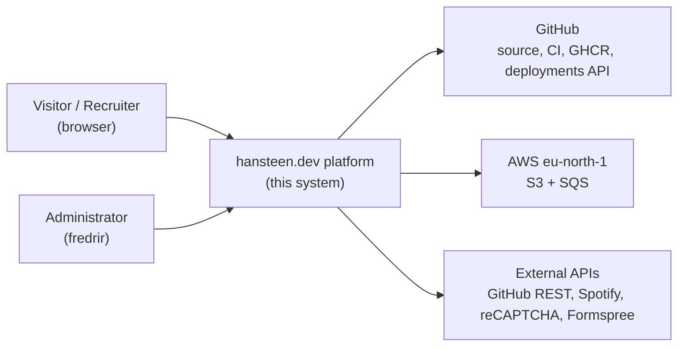
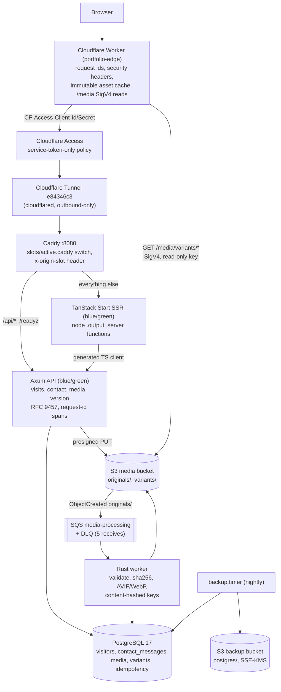
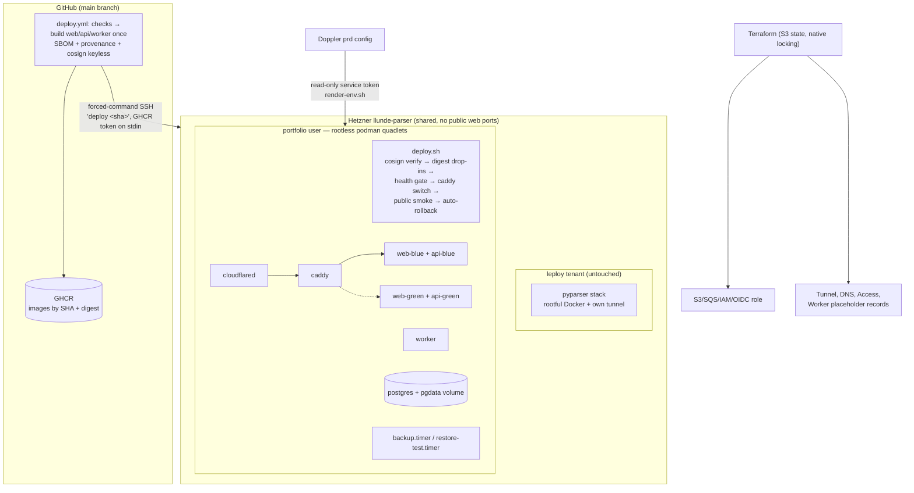

# hansteen.dev

- TanStack Start
- Rust (Axum) API
- PostgreSQL
- Private Hetzner origin behind a Cloudflare Worker Access and Tunnel
- Deployed blue-green from signed, attested images.

## Architecture

### System context



### Containers



### Deployment



## Layout

| Path | What it is |
|---|---|
| `apps/web` | TanStack Start app |
| `apps/api` | Axum API|
| `apps/worker` | Rust SQS consumer + CV release sync |
| `apps/edge` | Cloudflare Worker |
| `crates/terminal-plugins` | WASM terminal command |
| `packages/api-client` | TypeScript client|
| `infra/terraform` | AWS and Cloudflare|
| `infra/host` | bootstraps, rootless quadlets, deploy/rollback/backup scripts |

## Development

Requirements: [Bun](https://bun.sh), Rust (stable), Docker with compose, and the
[Doppler CLI](https://docs.doppler.com/docs/cli) (`doppler login`). Configuration
lives in the Doppler project `portfolio` (`dev`/`preview`/`prd`); `doppler.yaml`
binds this repo to the `dev` config — there is no `.env` file
(`.env.example` documents the variable names).

```bash
doppler setup --no-interactive              
docker compose up -d                      
bun install

bun run dev                                 # db/localstack + API + web
bun run dev:web                             # web app only, http://localhost:3000
bun run dev:api                             # API only, http://localhost:8080
doppler run -- cargo run -p portfolio-worker
```

### Checks

```bash
bun run lint
bun run --filter '@portfolio/web' typecheck build
cargo fmt --all --check && cargo clippy --workspace --all-targets -- -D warnings
cargo test --workspace      
cd packages/api-client && bun run check   
```


### Regenerating the API client

After changing API routes or schemas in `apps/api`:

```bash
cd packages/api-client && bun run generate
```

## Production-like containers

```bash
GIT_SHA=$(git rev-parse HEAD) docker compose --profile app up --build
```
