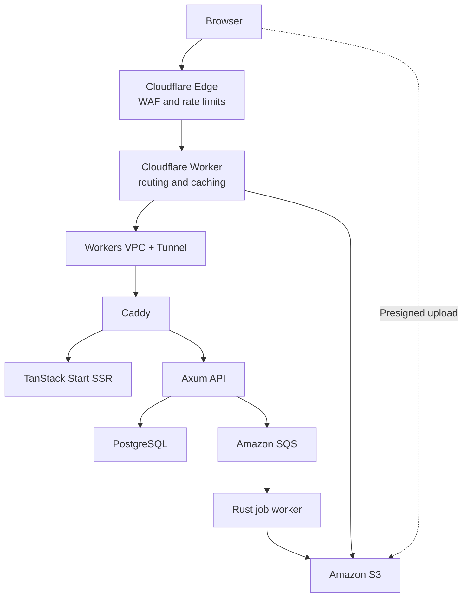

# Portfolio Platform — Refined Architecture and Delivery Plan

## 1. Objective

Build the portfolio as a small but credible production platform that demonstrates:

- frontend and backend architecture;
- Rust and TypeScript engineering;
- private origin networking;
- infrastructure as code;
- secure software delivery;
- observability and measurable service objectives;
- safe rollback and disaster recovery;
- event-driven processing.

The goal is not to use the maximum number of technologies. Every component must have a distinct responsibility and produce visible evidence that recruiters can inspect.

## 2. Architecture principles

1. Build artifacts once and promote the same immutable artifact.
2. Keep the Hetzner origin private behind Cloudflare Tunnel.
3. Give every machine and workflow a least-privilege identity.
4. Store durable data outside application containers.
5. Make database changes backward-compatible with blue-green releases.
6. Instrument every request with the same trace and request identifiers.
7. Automate rollback, restoration tests, and infrastructure drift detection.
8. Make the engineering visible through a public Engineering Mode.

## 3. Target runtime architecture

Administrative services use a separate route:

- admin.example.com → Cloudflare Access → Tunnel → administration interface
- analytics.example.com → Cloudflare Access → PostHog, if self-hosted later
- SSH → Cloudflare Access → Tunnel → host

Public ports 80 and 443 remain closed on the VPS. Cloudflared connects outward to Cloudflare and forwards traffic to an unprivileged local Caddy port.

## 4. Component responsibilities

| Component | Responsibility |
|---|---|
| Cloudflare edge | DNS, TLS, WAF, DDoS protection and coarse rate limits |
| Cloudflare Worker | Request IDs, routing, cache policy, security headers, media-origin signing and optional canary assignment |
| Workers VPC and Tunnel | Private connectivity from the Worker to explicitly registered origin services |
| Caddy | Local reverse proxy, blue-green upstream selection and origin health routing |
| TanStack Start | SSR, frontend routing, loaders and UI composition |
| Axum | Authentication, authorization, business logic, public API, media authorization, webhook handling and database access |
| Rust job worker | Media transformation, webhook processing, CV synchronization and contact delivery |
| PostgreSQL | Application data, media metadata, job/idempotency records and audit metadata |
| Amazon S3 | Durable originals, generated media variants, CV artifacts and encrypted backups in separate buckets |
| Amazon SQS | Durable job delivery, retries and dead-letter queues |
| Doppler | Development, preview and production secret configuration |
| OpenTelemetry stack | Traces, metrics and structured operational logs |
| PostHog | Product analytics only; not infrastructure monitoring |

## 5. Frontend and API boundary

### TanStack Start owns

- server-side rendering;
- frontend routes and layouts;
- UI-oriented loaders;
- browser state and progressive enhancement;
- calls through the generated API client.

### Axum owns

- authentication and authorization;
- domain and business rules;
- PostgreSQL access;
- OpenAPI contract;
- media upload authorization;
- GitHub webhook verification;
- search;
- administration API;
- public API.

TanStack server functions must not duplicate Axum business logic. Generate the TypeScript client from the Axum OpenAPI document using utoipa and fail CI when an incompatible API change is introduced.

Use SQLx migrations and RFC 9457 problem responses. Integration tests run against a disposable PostgreSQL instance.

## 6. Amazon S3 media architecture

Use separate S3 buckets for:

- production media;
- preview media;
- PostgreSQL backups;
- Terraform state, only if S3 is chosen as the state backend.

Do not store durable images on the VPS.

### Upload and processing flow

1. The administrator requests an upload through Axum.
2. Axum validates authorization and creates a pending media record.
3. Axum returns a short-lived, size- and content-type-constrained presigned upload.
4. The browser uploads the original directly to the private S3 bucket.
5. S3 sends an object-created event to SQS.
6. The Rust worker validates the actual file type, decoded dimensions and size.
7. The worker strips metadata and generates AVIF/WebP variants.
8. Variants use content-hashed immutable object keys.
9. PostgreSQL is updated atomically with dimensions, checksums and processing state.
10. Cloudflare serves approved variants and caches immutable responses.

### S3 controls

- Block Public Access;
- server-side encryption;
- versioning;
- lifecycle expiration;
- abandoned multipart-upload cleanup;
- narrowly scoped CORS;
- access logging;
- separate IAM permissions for uploads, processing, reads and backups;
- no bucket-wide wildcard permissions.

The Cloudflare Worker may sign read-only S3 origin requests using AWS Signature Version 4. Its credential is restricted to GetObject on the approved media prefix, stored as a Worker secret, monitored and rotated. GitHub Actions uses AWS OIDC instead of permanent AWS keys.

## 7. Event-driven worker

Use a Rust worker process with separate SQS queues for:

- media processing;
- GitHub webhook events;
- CV synchronization;
- contact delivery.

Each consumer must implement:

- an idempotency key;
- bounded retries with exponential backoff and jitter;
- a dead-letter queue;
- structured attempt logs;
- processing timeouts;
- explicit terminal failure states;
- administration replay with authorization and audit logging.

The first release only requires the media queue. Other consumers are added after the deployment platform is stable.

## 8. Host bootstrap and hardening

Use the existing "ssh letzner" alias for the one-time root bootstrap.

1. Create an unprivileged deployment user, the user should be called "portfolio".
2. Install its SSH key and disable password authentication.
3. Enable lingering for the deployment user so rootless systemd services start after reboot.
4. Install Podman, Caddy, cloudflared and required monitoring agents.
5. Configure Hetzner Cloud Firewall and nftables with default-deny inbound policy.
6. Keep public HTTP/HTTPS ports closed.
7. Put administrative SSH behind Cloudflare Access.
8. Enable automatic security updates and controlled reboot handling.
9. Apply CPU, memory, process and filesystem limits to every service.

> **Important!** The VPS already hosts other projects on user "leploy" — make sure this doesn't interfere with this project. See the addendum, item 2.

Run application containers as the deployment user through rootless Podman and systemd Quadlets. Use:

- read-only root filesystems where possible;
- no-new-privileges;
- dropped Linux capabilities;
- non-root container users;
- explicit health checks;
- restart limits;
- persistent volumes only for PostgreSQL and required local state.

Root should not be used for routine deployments.

## 9. Infrastructure as code

### Terraform manages

- Hetzner server, network, firewall and SSH key resources;
- Cloudflare DNS, Worker, Tunnel, Workers VPC services, Access and WAF configuration;
- AWS S3, SQS, bucket policies, encryption, versioning and lifecycle rules;
- AWS IAM roles and GitHub Actions OIDC trust;
- GitHub environments and selected repository settings where supported;
- monitoring and alert resources.

### Configuration management

- cloud-init performs the minimal first-boot bootstrap;
- Ansible applies and verifies host configuration;
- Quadlets define long-running application services;
- Terraform does not execute ongoing application deployments.

Use encrypted remote Terraform state with locking. Keep production and preview state separate. CI runs format, validate, TFLint, security policy checks and a plan on infrastructure pull requests. Production apply requires the protected GitHub production environment.

Run scheduled drift detection and pin provider versions.

## 10. CI/CD

### Feature-branch push

- Bun frozen install;
- frontend format, lint, typecheck, unit tests and build;
- Rust formatting, Clippy and unit tests;
- cancel superseded runs.

### Pull request

- all branch checks;
- PostgreSQL integration tests;
- Playwright end-to-end tests;
- OpenAPI compatibility check;
- Terraform validation and plan when infrastructure changes;
- cargo audit and cargo deny;
- CodeQL and secret scanning;
- Trivy filesystem/container scan;
- preview deployment only after the core platform is complete.

The pull-request workflow runs for opened, synchronized and reopened pull requests.

### Main branch

1. Re-run required checks.
2. Build frontend, Axum and worker OCI images once.
3. Tag images with the Git commit SHA.
4. Generate an SBOM and provenance attestations.
5. Sign images using keyless Cosign with GitHub OIDC.
6. Push immutable images to GHCR.
7. Invoke the narrowly scoped deployment command through Cloudflare Access.
8. Verify signatures on the VPS.
9. Start the inactive blue or green slot.
10. Run internal health checks and migrations.
11. Run smoke tests through the public Cloudflare route.
12. Switch Caddy to the new slot.
13. Monitor a short stabilization window.
14. Roll back automatically if validation fails.
15. Record the deployment in GitHub and expose its version through the engineering API.

Use a deployment concurrency group so only one production deployment can run at a time. Do not install a general-purpose GitHub Actions runner on the production VPS.

### Releases

Use semantic versions and automated release notes. A GitHub Release contains:

- changelog;
- image digests;
- SBOM;
- provenance;
- source commit;
- migration notes;
- rollback notes.

A main-branch deployment does not need to create a GitHub Release unless a version is being published.

## 11. Blue-green deployment and database migrations

Blue-green on one VPS provides low-downtime releases and rapid application rollback. It does not make the platform highly available because the VPS is still a single failure domain.

Use expand-contract database migrations:

1. Add backward-compatible schema.
2. Deploy code that supports old and new representations.
3. Backfill data asynchronously.
4. Switch traffic.
5. Verify the new version.
6. Remove obsolete schema in a later release.

CI must test the previous application version against the expanded schema. Destructive migrations require a backup and explicit production approval. Database migration failure prevents traffic switching.

## 12. Secrets and identities

Maintain separate Doppler configurations for development, preview and production.

- GitHub Actions retrieves Doppler secrets with OIDC.
- GitHub Actions assumes AWS roles through OIDC.
- The VPS receives only read-only or narrowly scoped runtime credentials.
- Cloudflare Worker secrets are synchronized during deployment without placing values in Terraform state.
- Build-time and runtime secrets remain separate.
- Secrets never enter OCI layers, logs, SBOMs or Terraform values.
- Rotation is tested without rebuilding the application.

Document each machine identity, its allowed resources and its rotation procedure.

## 13. Observability and service objectives

Propagate a request ID and OpenTelemetry trace context across:

Cloudflare Worker → Caddy → TanStack/Axum → PostgreSQL/SQS → Rust worker.

Collect:

- structured JSON logs;
- request count, latency and error metrics;
- queue depth, retry and dead-letter metrics;
- PostgreSQL connection and query metrics;
- container CPU, memory, disk and restart metrics;
- Cloudflare cache status;
- active application version.

Initial service objectives:

- public availability target: 99.9 percent;
- p95 cached-page latency target;
- p95 API latency target;
- zero undetected failed backups;
- all production releases health-gated;
- defined maximum queue age.

Use external synthetic checks. The public engineering page shows sanitized availability, latency, cache behavior, deployment version and last successful restoration test. It must not expose internal addresses, credentials, bucket names or sensitive logs.

PostHog measures product behavior. Use PostHog Cloud EU initially or move it to a separate VPS later; do not let analytics compete with the production application for resources.

## 14. Backup and disaster recovery

- Encrypted PostgreSQL backups go to a dedicated S3 backup bucket.
- Apply retention, versioning and object-lock policy where appropriate.
- Perform scheduled restoration into a disposable database.
- Validate row counts, migrations and application startup after restoration.
- Alert on backup age, restoration failure and insufficient disk space.
- Document recovery-point and recovery-time objectives.
- Provide a manually triggered disaster-recovery workflow.

Run a periodic rebuild exercise:

1. provision a blank replacement VPS;
2. apply cloud-init and Ansible;
3. restore PostgreSQL;
4. deploy signed images;
5. verify S3 media access;
6. execute public smoke tests;
7. record the measured recovery time.

## 15. Recruiter-visible features

### Engineering Mode

Show:

- Cloudflare location;
- cache hit or miss;
- request and trace IDs;
- edge, Axum and database latency;
- Git commit;
- image digest and signature status;
- current blue/green slot.

### Deployment dashboard

Show:

- current and previous releases;
- deployment duration;
- health and smoke-test results;
- rollback events;
- SBOM/provenance links;
- sanitized SLO status.

### Media laboratory

Show:

- original and generated formats;
- dimensions and compression ratios;
- content hash;
- processing duration;
- cache state;
- safe comparison between variants.

These three features are required before adding more showcase systems.

## 16. CV release synchronization

The CV repository remains the source of truth.

1. Its CI builds the PDF once.
2. A versioned GitHub Release publishes the PDF, checksum and source commit.
3. The portfolio worker receives a signed webhook or periodically checks the release API.
4. It downloads and verifies the artifact.
5. It stores the file under a versioned S3 key.
6. PostgreSQL atomically selects the active CV version.
7. The public page exposes the CV version and last-updated timestamp.

Do not rebuild the CV inside the portfolio repository.

## 17. Deferred features

Add only after the core platform meets its acceptance criteria:

- isolated PR previews on a separate low-cost VPS;
- Tantivy search after enough content exists to justify an index;
- GitHub webhook administration and replay;
- passkey-protected administration;
- canary releases and feature flags;
- offline page support;
- offline contact submission only after privacy, expiry and deduplication rules are defined;
- self-hosted PostHog on a separate host;
- controlled chaos tests in a non-production environment.

## 18. Delivery phases and acceptance criteria

### Phase 1 — Application foundation

- TanStack Start replaces Next.js.
- Bun replaces pnpm with a committed frozen lockfile.
- Axum exposes the documented API.
- The generated TypeScript client is used by the frontend.
- PostgreSQL migrations and integration tests pass.

Exit criterion: the complete application runs locally in production-like containers.

### Phase 2 — Media and background work

- Private S3 media bucket is provisioned.
- Direct presigned upload works.
- S3 → SQS → Rust worker processing works.
- Generated formats are validated and delivered through Cloudflare.
- Failed jobs enter a dead-letter queue.

Exit criterion: an uploaded image is processed, published and traceable end to end without durable VPS storage.

### Phase 3 — Infrastructure and private ingress

- Terraform provisions Hetzner, Cloudflare and AWS resources.
- The deployment user and rootless Quadlets are configured.
- Root and password SSH are disabled.
- Public origin ports are closed.
- Worker → Workers VPC → Tunnel → Caddy routing works.

Exit criterion: a blank VPS can be provisioned into a working private origin using documented automation.

### Phase 4 — Secure delivery

- CI produces immutable signed images.
- GHCR stores images by digest.
- Blue-green deployment performs health-gated switching.
- Failed smoke tests trigger rollback.
- Expand-contract migration tests pass.

Exit criterion: a deliberately broken release fails safely without replacing the healthy production slot.

### Phase 5 — Operations

- OpenTelemetry traces span edge, origin, database and queue worker.
- Dashboards and alerts are active.
- S3 backups and automated restoration tests succeed.
- Engineering Mode and deployment dashboard are public.

Exit criterion: deployment, failure, rollback and restoration are visible and reproducible.

### Phase 6 — Portfolio expansion

- CV synchronization;
- GitHub project ingestion;
- search;
- preview environments;
- additional administration and product analytics.

Exit criterion: each additional feature has a documented reason, owner, threat model and measurable behavior.

## 19. Repository documentation

Include:

- C4 context, container and deployment diagrams;
- architecture decision records;
- trust-boundary threat model;
- deployment, rollback and disaster-recovery runbooks;
- OpenAPI documentation;
- SLO definitions;
- load-test methodology and results;
- monthly infrastructure cost;
- capacity limits;
- one simulated-incident postmortem;
- screenshots or links to sanitized dashboards and traces.

## 20. Definition of done

The platform is complete when:

- infrastructure can be recreated from documented automation;
- the origin has no public web ingress;
- production deploys immutable signed images;
- an unhealthy release cannot receive production traffic;
- the previous application version remains compatible during schema expansion;
- media survives total VPS loss;
- backup restoration is tested automatically;
- every production request can be correlated across edge and origin;
- no long-lived AWS credential exists in GitHub Actions;
- recruiters can inspect the architecture, deployment history and performance without privileged access.

---

## Addendum — known gaps and pending decisions (2026-07-11)

Identified while reconciling this plan against the repository state; each needs an explicit
decision before its phase begins.

### 1. Supabase migration is unstated (blocks Phase 1 completion)

The current application stores gallery, visitor and contact data in Supabase
(`src/lib/supabase.ts`, `src/app/actions/`). The plan implicitly replaces this with
self-hosted PostgreSQL but never says so. Phase 1 must include: schema recreation in SQLx
migrations, data export/import from Supabase, and removal of `@supabase/supabase-js`.

### 2. Shared VPS constrains hardening, Terraform and DR — RESOLVED 2026-07-11

Audited; see [vps-audit.md](vps-audit.md). Summary: the host already has no public web
ingress (only sshd on 22; leploy's stack uses its own Cloudflare Tunnel under rootful
Docker), so there is no firewall conflict. Decisions: keep ufw (no raw nftables rewrite),
Terraform never manages the shared server resource, DR rebuild exercises use a scratch
server, and moving SSH behind Cloudflare Access is deferred until coordinated with
leploy's access needs.

### 3. Workers VPC availability — VERIFIED 2026-07-11

`wrangler vpc service list` succeeds on the account (open beta), so Workers VPC private
origins are available. The Terraform `cloudflare-ingress` module keeps the Access
service-token fallback as the default (`enable_workers_vpc = false`) until the VPC
routing is actually built and tested; the VPC service itself is created via wrangler/API
while the feature is in beta.

### 4. Vercel exit

`@vercel/analytics` and `@vercel/speed-insights` are removed with the Next.js/Vercel exit;
PostHog replaces product analytics. DNS moves to Cloudflare when Phase 3 lands.
