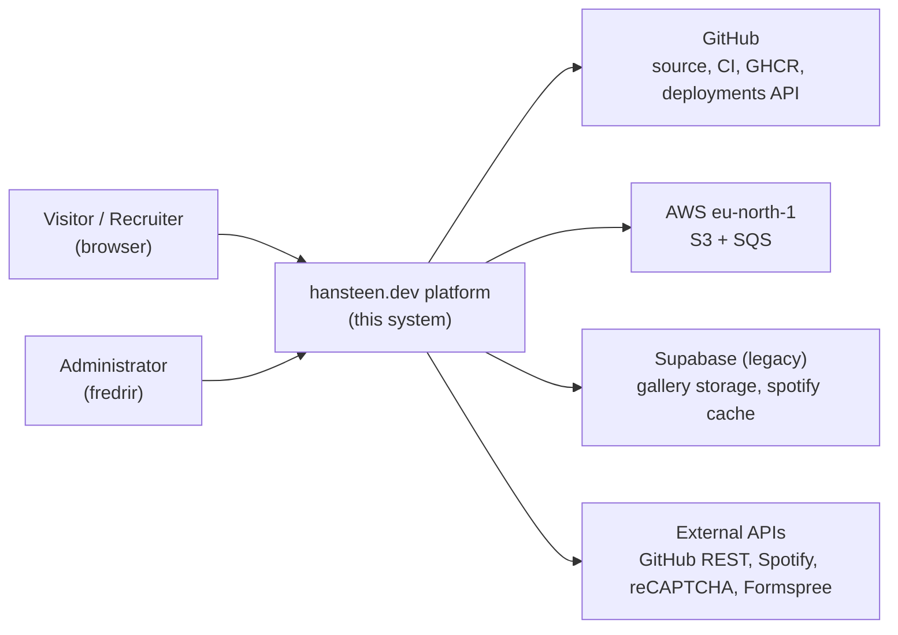
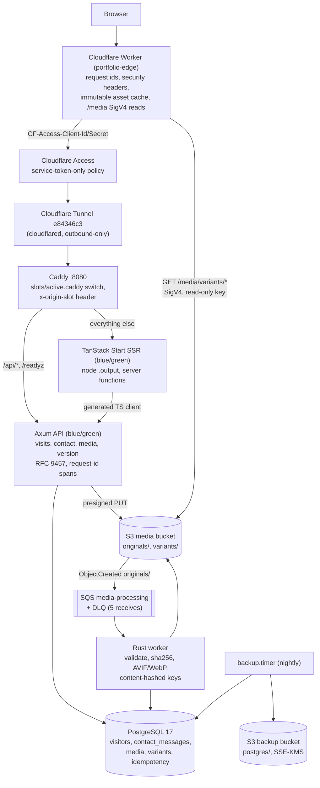
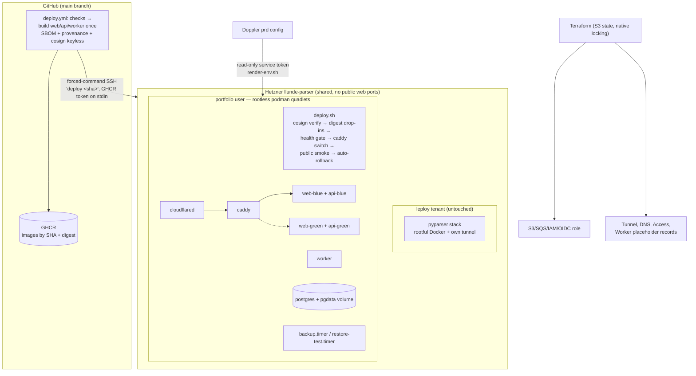

# C4 diagrams

Rendered as mermaid flowcharts at the three C4 altitudes that matter here.
Hostnames: the platform serves `new.hansteen.dev` today; the apex
`hansteen.dev` moves from Vercel to the edge Worker at cutover.

## Level 1 — System context

## Level 2 — Containers

## Level 3 — Deployment

Trust boundaries are drawn in [threat-model.md](threat-model.md); operational
procedures in [runbooks.md](runbooks.md).
